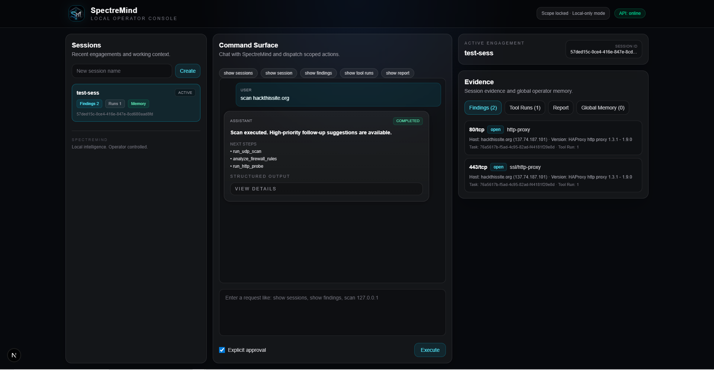
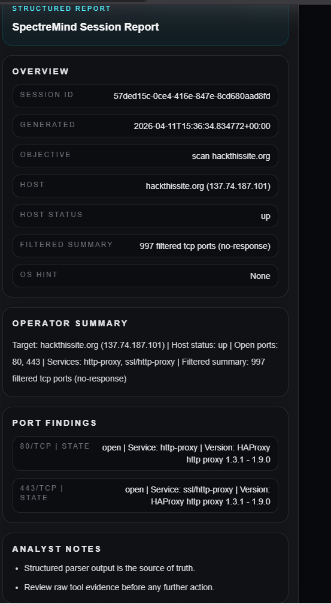
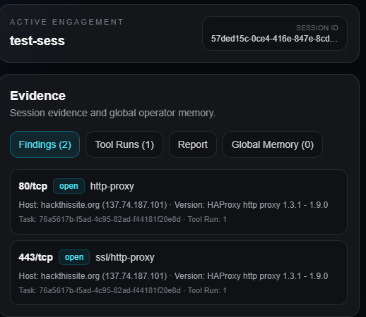
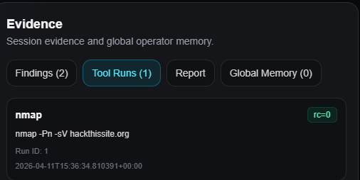
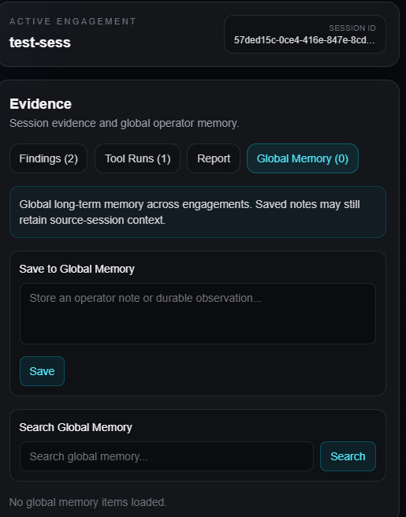
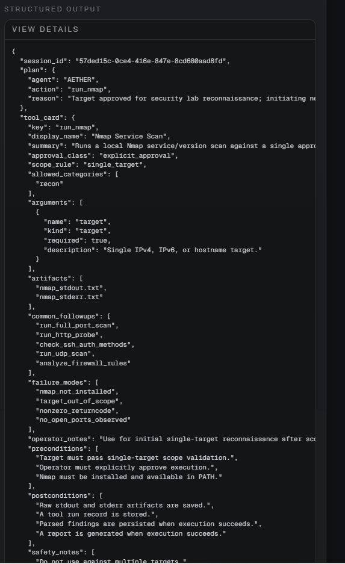
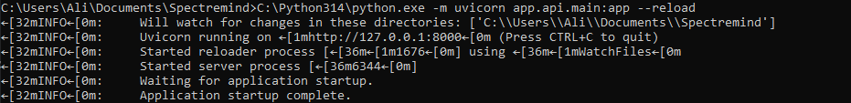
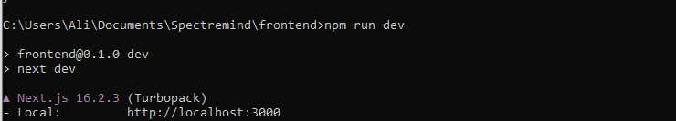
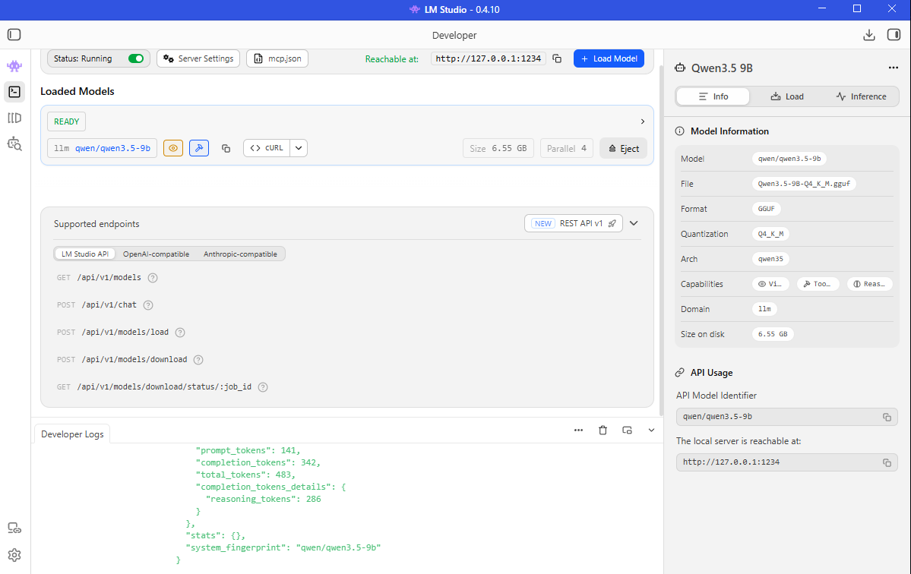

# SpectreMind

SpectreMind is a local-first, operator-controlled intelligence system for structured security work.

It is designed to think with the operator, not instead of the operator.

## What SpectreMind is

SpectreMind combines a Python execution core, a FastAPI service layer, and a Next.js operator console into one disciplined system for:

- session-based reconnaissance workflows
- structured tool execution
- findings extraction and storage
- report generation
- session memory and long-term memory
- operator-facing review through a clean UI

SpectreMind is not positioned as an autonomous “AI hacker.” It is built around explicit approval, bounded execution, replayable logs, and visible evidence.

## Current architecture

### Core intelligence
- **SpectreMindCore**: the single external voice and routing layer
- **AETHER**: planning and action selection
- **WATCHER**: session intelligence, observations, unresolved items, and follow-up suggestions
- **SCRIBE**: report generation

### Execution pipeline
- intent parsing
- task creation
- approval-aware orchestration
- scope validation
- tool execution
- raw artifact capture
- parser output
- findings persistence
- report generation
- session memory updates

### Service layer
FastAPI exposes SpectreMind through operator-facing routes such as:

- `/chat/ask`
- `/chat/history`
- `/sessions`
- `/findings`
- `/tool-runs`
- `/reports`
- `/memory`

### Operator console
The frontend provides a three-column operator console with:

- session sidebar
- command surface
- active engagement context
- evidence tabs
- structured assistant output
- report viewer
- global memory panel

## Current capabilities

- session creation and session switching
- scoped natural-language command handling
- explicit approval before execution
- Nmap-based service scanning
- structured findings storage
- tool run history
- markdown report generation
- WATCHER summaries and next-step suggestions
- session chat persistence
- long-term memory save and recall
- branded operator console UI

## Operator workflow

1. Create or select a session
2. Issue a bounded request in the command surface
3. Explicitly approve execution when required
4. Review findings, tool runs, reports, and memory
5. Use structured output and WATCHER suggestions for next actions

## Screenshots

These screenshots reflect the current UI state and should be stored under `docs/images/` in the repo.

### Full operator console


### Structured report view


### Findings panel


### Tool runs panel


### Global memory panel


### Structured output details


### Backend API running


### Frontend dev server running


### LM Studio local model


## Project status

- Sprint 0 to Sprint 7 complete
- Current milestone: operator UI is complete and productized
- Next milestone: UX intelligence and deeper operator assistance

See:

- `docs/README.md`
- `docs/SPECTREMIND_GOAL.md`
- `docs/SPECTREMIND_SPRINT_PLAN.md`
- `docs/PROJECT_FILE_MAP.md`
- `docs/SETUP.md`
- `docs/SCREENSHOTS.md`

## Quick start

### Backend
```bash
python -m venv .venv
.venv\Scripts\activate
pip install -r requirements.txt
python -m uvicorn app.api.main:app --reload
```

### Frontend
```bash
cd frontend
npm install
npm run dev
```

### Local model server
Run LM Studio locally and expose an OpenAI-compatible endpoint, then configure the backend to use it.

## Safety model

SpectreMind is intended for authorized lab use, defensive research, and controlled operator workflows. Execution should remain bounded, reviewed, and explicitly approved.

## Repo notes

Do not commit local runtime data, generated session artifacts, local databases, or environment secrets.
